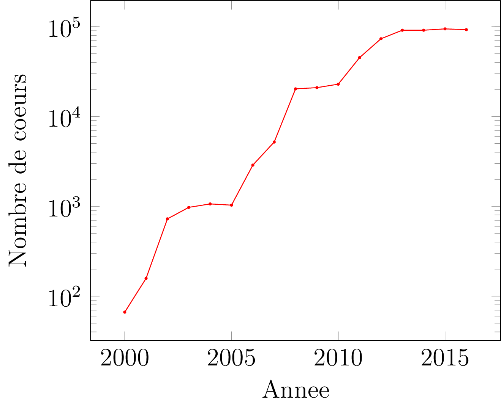
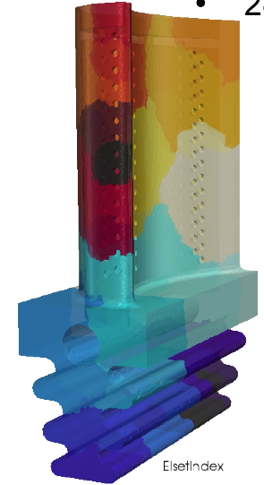
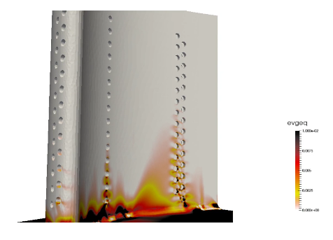

+++ {"slideshow": {"slide_type": "slide"}}

# Introduction au parallélisme 
## Mines Paris-Tech 
**Basile Marchand**

+++ {"slideshow": {"slide_type": "slide"}}

# Introduction 

## Objectifs du cours 

Bienvenue dans ce cours sur la programmation parallèle.

Pour le moment dans tous les cours de programmation que vous avez eus au premier semestre, que vous ayez appris C++, Python ou Java, vous ne vous êtes pas vraiment posé la question de savoir si les programmes que vous avez écrits utilisaient pleinement vos ressources en terme de moyens de calcul.

Et je peux vous répondre tout de suite : non vous n'avez pas du tout utilisé l'intégralité de vos ressources informatiques. Et c'est bien normal car vous n'avez pas appris comment le faire !! En effet pour utiliser l'ensemble des ressources disponibles, sur votre ordinateur portable par exemple, il est nécessaire de le faire volontairement, et c'est ce que nous allons voir dans ce cours. 

L'objectif de ce cours est donc de vous donner les éléments de base pour que vous soyez à même de réaliser des programmes en **Python** capables d'exploiter vos ressources informatiques au maximum.

+++ {"slideshow": {"slide_type": "slide"}}

## Repartons de la base, votre ordinateur portable

+++ {"slideshow": {"slide_type": "subslide"}}

Pour commencer repartons de la base. Comment fonctionne votre ordinateur portable ? Alors vous avez déjà eu une introduction aux systèmes d'exploitation ce qui fait que les choses que je vais dire ne seront normalement que des banalités mais, comme on dit, il faut répéter pour que ça rentre. 

Un ordinateur portable (ou pas portable d'ailleurs) c'est : 

* Un hardware : l'objet physique et ses composants
* Du software : principalement votre système d'exploitation qui permet de faire fonctionner correctement la partie hardware

Je ne m'attarderai pas plus que cela sur la partie software/OS car comme je l'ai déjà dit vous avez eu un cours la dessus.

+++ {"slideshow": {"slide_type": "subslide"}}

En revanche si l'on regarde la partie hardware, on peut à la louche décomposer un ordinateur en trois composants : 
* Le processeur
* La mémoire vive 
* Le disque dur 

Je sais, il y a plein d'autres trucs par exemple l'écran, la carte graphique, ... mais on va dire que selon ma définition le minimum vital pour que l'on puisse parler d'ordinateur c'est : processeur, mémoire vive et disque dur. Quoique, petit aparté, la prise en compte du disque dur peut être discutable dans ma définition car il y a aujourd'hui des ordinateurs dits *diskless*, mais c'est un autre débat.

+++ {"slideshow": {"slide_type": "subslide"}}

Et donc à partir de ces éléments : comment fonctionne l'exécution d'un programme ? C'est simple : c’est à partir de votre programme binaire stocké sur le disque dur. Quand vous lancez l'exécution, il se passe les étapes suivantes : 

1. Le système d'exploitation charge votre programme en mémoire vive
2. Votre programme commence à dire au processeur qu'il doit réaliser des instructions 
3. Le processeur, quand c'est au tour de votre programme de travailler :  
    a. Récupère en mémoire les variables dont il a besoin  
    b. Exécute une série d'instructions ordonnée par votre programme  
    c. Range en mémoire le résultat issu de la série d'instructions  
    
Le point important se situe au niveau de l'étape 3, i.e. le **processeur** !

+++ {"slideshow": {"slide_type": "subslide"}}

Mais avant, faisons un peu d'archéologie des processeurs.

Non je plaisante, je ne vais pas vous faire toute le genèse de l'informatique depuis les cartes perforées jusqu'à l'ordinateur quantique. Je me contenterai de vous donner une date clé : 2001 la sortie du POWER4 par IBM (je fais vieux sage, mais j'ai dû chercher sur Internet car à cette date je n'avais encore jamais touché un ordinateur…).

Qu'est ce qu'il a de particulier ce POWER4 ? vous vous demandez. Et bien c'est le premier processeur du marché à être équipé de **deux** cœurs ! Oui vous avez bien lu **deux**. Alors puisque l'on est dans les dates on peut également citer 2005 avec la sortie des premiers processeurs Intel et AMD en dual-core.

+++ {"slideshow": {"slide_type": "subslide"}}

Et alors qu'est ce que ça a de révolutionnaire ? Eh bien, l'arrivée des processeurs multi-cœurs représente un changement de paradigme complet. Car avant cela il n'y avait que des processeurs mono-cœur, donc les instructions s’exécutaient en séquentiel. L'arrivée des multi-cœurs signe l'arrivée du traitement en parallèle des tâches. En effet à partir de ce moment on a deux fois plus de bras pour travailler donc on peut faire des choses simultanément. 

Pour la petite histoire, pourquoi ce changement de vision brusque, passage des architectures mono-cœur à des architectures multi-cœurs ? Pour une raison toute simple, pendant des années l'évolution et la montée en gamme des processeurs était directement proportionnelle au nombre de transistors intégrés dans le processeur. Il s'agit de la fameuse loi de Moore qui stipule que le nombre de transistors constituant un processeur, et donc sa puissance de calcul, double tous les deux ans. Et pendant des années cette loi a été vérifiée et la montée en gamme des processeurs se faisait "naturellement" avec l'évolution des transistors. Sauf que vers le début des années 2000 la loi de Moore a commencé à avoir du plomb dans l'aile... et donc il a fallu trouver une parade pour continuer à faire évoluer les processeurs. La solution la plus simple a été de se dire : si on ne peut pas aller deux fois plus vite avec un processeur, eh bien on va en faire deux fois plus. Et c'est comme ça que les processeurs dual-core ont commencé à apparaître.

+++ {"slideshow": {"slide_type": "subslide"}}

Pour l'anecdote les objectifs d'Intel en terme de performance en 2002 étaient d'avoir à l'horizon 2005 des processeurs cadencés à 10 GHz. Ils ont abandonné en cours de route pour passer sur les architectures multi-cœurs. Visiblement ils ont bien fait car les processeurs récents les plus performants ont une fréquence d'horloge de 5 GHz et nécessitent pour cela un refroidissement à l'azote liquide...

Mais revenons à nos moutons, les processeurs multi-cœurs. Aujourd'hui cela peut sembler banal vous avez des processeurs multi-cœurs dans votre ordinateur, dans votre téléphone, avec en moyenne 4 cœurs. Sachant que pour les processeurs destinés aux serveurs les plus récents et les plus haut de gamme, on peut avoir jusqu'à 32, 64 voir même 96 cœurs par processeurs. On peut donc raisonnablement admettre qu’aujourd’hui le modèle standard est aux processeurs multi-cœurs.

+++ {"slideshow": {"slide_type": "slide"}}

## Des cœurs encore et toujours plus

+++

Nous venons de le dire, les processeurs ont aujourd'hui tous des architectures multi-cœurs, et je dirais même que la tendance actuelle est d'avoir toujours plus de cœurs dans un processeur, allez faire un tour sur les sites d'AMD pour vous en convaincre. 

Mais bien avant que les processeurs multi-cœurs commencent à apparaître, des personnes avaient déjà eu l'idée d'associer des processeurs entre eux pour disposer d'une puissance de calcul plus élevée. C'est de cette idée que sont nés les supercalculateurs/clusters.

+++ {"slideshow": {"slide_type": "subslide"}}

Le principe est simple : on prend tout un tas d'ordinateurs (que l'on appelle nœud de calcul dans ce contexte) et on les connecte entre eux. Bien que le principe soit simple, la mise en œuvre est plus délicate. En effet la mise en place et l'utilisation des clusters a entraîné deux problématiques, toujours d'actualité, qui sont : 

1. Au niveau hardware : comment fait-on pour interconnecter de nombreux ordinateurs entre eux tout en ayant comme souci premier la performance ? 
2. Au niveau software : comment adapter un logiciel prévu pour ne fonctionner que sur un ordinateur mono-cœur à une architecture composée de plusieurs ordinateurs connectés entre eux via un réseau dédié.

Nous verrons dans la suite comment ces deux problématiques sont traitées actuellement.

+++ {"slideshow": {"slide_type": "subslide"}}

Pour vous donner quelques ordres de grandeurs voici ci-dessous l'évolution du nombre de cœurs du premier cluster Français dans le [top 500](http://www.top500.org) entre 2000 et 2017.  



+++ {"slideshow": {"slide_type": "subslide"}}

On constate que la tendance est donc aux machines disposant de plusieurs milliers de cœurs. On peut remarquer au passage que dans la période 2005-2008, il y a eu une accélération du nombre de cœurs. En 2005 : première commercialisation par Intel et AMD de processeur multi-cœurs, un hasard ? 

Et donc avec les processeurs multi-cœurs le standard du super calculateur est devenu une architecture parallèle à deux niveaux : 

1. Premier niveau : un ensemble de nœuds interconnectés via un réseau rapide dédié
2. Second niveau : sur chaque nœud un ou plusieurs processeur multi-cœurs.


Pour vous donner un exemple concret, le cluster du Centre des Matériaux (Laboratoire de l'École des Mines, je le rappelle au cas où) est constitué de 34 nœuds de calcul, chaque nœuds étant équipé de 2 processeurs Intel de 12 cœurs. Cela fait donc un total de 816 cœurs à disposition.

+++ {"slideshow": {"slide_type": "slide"}}

## Toujours plus de cœurs, mais pour faire quoi ?

+++ {"slideshow": {"slide_type": "subslide"}}

Pour quelle raison le nombre de cœurs par processeur et la taille des clusters continuent-elles à évoluer ? Pour une raison très simple : les problèmes que l'on souhaite résoudre aujourd'hui sont bien plus complexes et nécessitent donc beaucoup plus de ressources que ceux d'hier ! 

Quels sont les problématiques pouvant nécessiter l'utilisation massive de l'informatique parallèle ? Impossible de faire une liste exhaustive !! Mais le périmètre est extrêmement large : physique, science des matériaux, météorologie, génétique, médecine, ... J'ai envie de dire qu'il y a du calcul parallèle dans tous les domaines scientifiques et même au-delà. Par exemple dans la finance il y a d'énormes besoins en terme de ressources de calcul.

+++ {"slideshow": {"slide_type": "subslide"}}

Mais pour vous donner une application concrète recentrons nous sur des problématiques plus parlantes, pour moi en tout cas, la mécanique des matériaux solides. Considérons par exemple la simulation de la durée de vie d'une aube de turbine d'un moteur d'avion. Il s'agit d'une simulation complexe car devant prendre en compte de nombreux facteurs : 

* l'aube est une géométrie complexe
* le matériau constitutif de l'aube est un matériau complexe dont le comportement est gouverné par des lois non-linéaires complexes
* le calcul doit faire intervenir les aspects thermiques, car l'aube en question se situe en sortie de chambre de combustion et est donc soumise à des gradients thermiques conséquents.

+++ {"slideshow": {"slide_type": "subslide"}}

Tous ces éléments font qu'il s'agit d'un problème complexe à résoudre. La résolution de ce problème en utilisant une architecture mono-cœur, c'est-à-dire une résolution séquentielle prendrait approximativement entre deux et trois semaines de calcul pour un cycle (c'est-à-dire un vol classique d'une heure). Tandis qu’en exploitant les architectures de calcul parallèle moderne ce temps de calcul est réduit à 4.5 heures en utilisant 192 cœurs.

Pour cela le principe est de décomposer le problème initial en $N$ sous-problèmes, dans notre cas on découpe notre géométrie (figure de gauche), et pour chaque sous-problème on utilise plusieurs cœurs, et on met alors en marche des méthodes de résolution dédiées.

<table><tr>
<td>  </td>
<td>  </td>
</tr></table>

```{code-cell} ipython3
---
slideshow:
  slide_type: subslide
---
from IPython.display import HTML

# Youtube
HTML('<iframe width="1120" height="630" src="https://www.youtube.com/embed/hhB7zQuL2QA?rel=0&amp;controls=0&amp;showinfo=0" frameborder="0" allowfullscreen></iframe>')
```

```{code-cell} ipython3
---
slideshow:
  slide_type: subslide
---
from IPython.display import HTML

# Youtube
HTML('<iframe width="1120" height="630" src="https://www.youtube.com/embed/5x3UTOvm8AA?rel=0&amp;controls=0&amp;showinfo=0" frameborder="0" allowfullscreen></iframe>')
```

```{code-cell} ipython3

```
