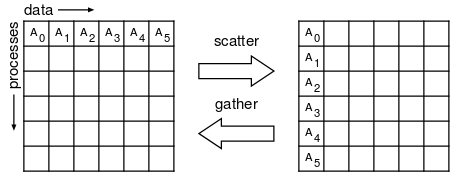
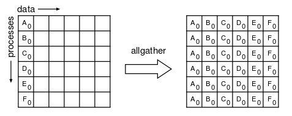
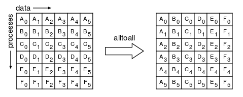

+++ {"slideshow": {"slide_type": "slide"}}

# Parallélisme à mémoire distribuée

+++ {"slideshow": {"slide_type": "subslide"}}

## Notebook et parallélisme à mémoire distribuée

+++ {"slideshow": {"slide_type": "subslide"}}

### Configuration de votre environnement

+++ {"slideshow": {"slide_type": "subslide"}}

Afin de pouvoir faire du parallélisme à mémoire partagée en Python et plus particulièrement dans des notebooks jupyter il va falloir faire quelques installations. 

La première étape va consister à vous créer un environnement conda dédié à ce cours, ce qui vous permettra de ne pas polluer votre environnement par défaut. 

Pour cela ouvrez un terminal et tapez

```bash 
conda create -n parallel python=3.7
conda activate parallel
``` 

Nous allons ensuite installer l'ensemble de modules python que nous allons utiliser dans cette partie 
```bash 
conda install numpy matplotlib mpi4py jupyter ipyparallel
```

Il vous faut ensuite activer l'extension jupyter permettant de faire du parallèle dans les notebooks. 

```bash 
jupyter serverextension enable --py ipyparallel
```

C'est cette extension qui va vous permettre de créer un cluster local vous permettant de faire du parallélisme dans vos notebook. Il vous faut pour cela configurer votre "cluster" en utilisant la commande 

```bash 
ipython profile create --parallel --profile=mpi
```

Il faut ensuite que vous modifiez le fichier `$HOME/.ipython/profile_mpi/ipcluster_config.py`pour lui ajouter la ligne suivante 

```python
c.IPClusterEngines.engine_launcher_class = 'MPIEngineSetLauncher'
```

A partir de maintenant votre configuration est terminée.

+++ {"slideshow": {"slide_type": "subslide"}}

### Test de votre environnement

+++ {"slideshow": {"slide_type": "fragment"}}

Nous allons à présent vérifier que votre environnement parallèle fonctionne correctement. Pour cela il faut dans un premier temps lancer le server. Pour cela ouvrez un nouveau terminal et tapez

```bash 
conda activate parallel ## Pour activer le bon environement conda
ipcluster start --profile=mpi
```

Si tout fonctionne bien vous devez avoir, au bout de quelques secondes, en dernière ligne du message la ligne suivante :

```
[IPClusterStart] Engines appear to have started successfully
```

+++ {"slideshow": {"slide_type": "subslide"}}

Nous pouvons ensuite initialiser le client de notre cluster de calcul pour le notebook

```{code-cell} ipython3
---
slideshow:
  slide_type: fragment
---
import ipyparallel as parallel
clients = parallel.Client(profile="mpi")
clients.block = False  # use synchronous computations
print(clients.ids)
```

+++ {"slideshow": {"slide_type": "fragment"}}

On observe que le cluster se compose de 4 cœurs ce qui correspond au nombre de cœurs disponibles sur mon ordinateur portable.

+++ {"slideshow": {"slide_type": "subslide"}}

Pour vérifier que tout est opérationnel il nous suffit alors de regarder si notre communicateur MPI a la bonne taille et établit bien la communication entre nos 4 cœurs.
Pour cela on peut appeler le code suivant et si tout fonctionne on doit avoir, sur chaque cœur, un communicateur de taille 4.
Si c'est le cas c'est que tout fonctionne correctement et on va pouvoir passer aux choses sérieuses.

```{code-cell} ipython3
---
slideshow:
  slide_type: fragment
---
%%px
from mpi4py import MPI

print(MPI.COMM_WORLD.Get_size())
```

+++ {"slideshow": {"slide_type": "fragment"}}

**Attention :** il faut bien noter le fait que la cellule commence par la *magic command* `%%px` qui indique à jupyter que la cellule en question doit être exécutée en parallèle.

+++ {"slideshow": {"slide_type": "slide"}}

## Message Passing Interface en Python

+++ {"slideshow": {"slide_type": "subslide"}}

### mpi4py

+++ {"slideshow": {"slide_type": "fragment"}}

Comme nous l'avons vu dans le notebook 2 la seconde manière d'exploiter les architectures de calcul modernes est de faire du parallélisme à mémoire distribuée.
Nous avons également vu qu'il existe ou a existé un certain nombre de manières de faire ce parallélisme mais que depuis maintenant de nombreuses années une approche est privilégiée : celle d'utiliser le Message Passing Interface (MPI).

+++ {"slideshow": {"slide_type": "fragment"}}

L'implémentation de MPI en python est fait dans le module mpi4py qui est en réalité une surcouche Python des implémentations MPI en C classiques.
Elle permet donc d'avoir directement dans Python toute les possibilités de MPI et en plus dans un format plus sympathique à utiliser que ce que l'on trouve dans les langages de plus bas niveau type C, C++, FORTRAN.

+++ {"slideshow": {"slide_type": "subslide"}}

Plus précisément pour utiliser MPI dans Python il faut utiliser le sous-module MPI du module mpi4py. Son import se fait de la manière classique suivante :

```{code-cell} ipython3
---
slideshow:
  slide_type: fragment
---
%%px
from mpi4py import MPI
```

+++ {"slideshow": {"slide_type": "slide"}}

### Notion de communicateur

+++ {"slideshow": {"slide_type": "subslide"}}

Dans le paradigme MPI l'élément central du développement est ce que l'on appelle le **communicateur**. Il porte bien son nom puisque son seul rôle est de définir qui communique avec qui, plus précisément un communicateur représente un ensemble de processus MPI pouvant communiquer entre eux.

+++ {"slideshow": {"slide_type": "fragment"}}

Il existe un communicateur par défaut dans MPI qui s'appelle `COMM_WORLD` et qui là encore porte bien son nom puisqu'il s'agit du communicateur comprenant l'ensemble des processus MPI lancés. C'est ce communicateur qui va permettre à tous les processus de communiquer entre eux, soit en mode point à point, soit en mode collectif.

Dans `mpi4py` pour récupérer le communicateur il suffit simplement de récupérer la variable `COMM_WORLD` du module `MPI`.

```{code-cell} ipython3
---
slideshow:
  slide_type: fragment
---
%%px
comm = MPI.COMM_WORLD
print(comm)
```

+++ {"slideshow": {"slide_type": "subslide"}}

A partir de ce communicateur nous pouvons déjà déterminer :
* La taille du communicateur, i.e. le nombre de processus qu'il met en relation
* Le rank de chaque processus dans ce communicateur

```{code-cell} ipython3
---
slideshow:
  slide_type: fragment
---
%%px 
print( f"Je suis le processus {comm.Get_rank()} sur {comm.Get_size()}")
```

+++ {"slideshow": {"slide_type": "subslide"}}

Depuis le début je vous parle d'un communicateur et non pas du communicateur. C'est pour la simple et bonne raison que le communicateur COMM_WORLD n'est pas unique. Il s'agit juste du communicateur par défaut mais on peut en créer d'autres. On parle généralement de sous-communicateurs. Quel intérêt vous demandez vous ?
Cela dépend du problème que l'on traite. Mais il peut arriver que l'on ait besoin de faire des opérations de communication sur un sous-ensemble de processus MPI. Dans ce cas il est généralement plus malin de créer un sous-communicateur regroupant les processus concernés. 

+++

Par exemple imaginons que l'on veuille que nos processus de rang pair ne communiquent qu'entre eux et de même pour nos processus de rang impair. La solution serait de créer un sous-communicateur pour les processus de rang pair et un autre pour les processus de rang impair.

```{code-cell} ipython3
---
slideshow:
  slide_type: skip
---
%%px

comm.group.rank
```

```{code-cell} ipython3
---
slideshow:
  slide_type: subslide
---
%%px

rank = comm.Get_rank()
grp = comm.Get_group()

grp_impair = grp.Excl([0,2])
comm_impair = comm.Create_group(grp_impair)

grp_pair = grp.Excl([1,3])
comm_pair = comm.Create_group(grp_pair)

if rank%2 != 0:
    print( f"Je suis le processus impair {comm_impair.Get_rank()} sur {comm_impair.Get_size()}")
else:
    print( f"Je suis le processus pair {comm_pair.Get_rank()} sur {comm_pair.Get_size()}")
```

+++ {"slideshow": {"slide_type": "subslide"}}

De cette manière on peut facilement échanger des données entre processus pair, processus impair ou l'ensemble des processus. Cela permet dans certains cas de figure d'optimiser le développement et de minimiser les communications. Car comme cela a été montré dans le notebook 2 les communications entre processus MPI ont un coût pouvant être non négligeable.

+++ {"slideshow": {"slide_type": "fragment"}}

Bien évidemment ce n'est ici qu'une présentation succincte de ce qu'il est possible de faire avec les communicateurs. Pour avoir de plus amples informations je vous conseille de lire le cours de l'IDRIS [http://www.idris.fr/media/formations/mpi/idrismpi.pdf](http://www.idris.fr/media/formations/mpi/idrismpi.pdf)

+++ {"slideshow": {"slide_type": "slide"}}

### C'est jolie le communicateur mais pour le moment on a pas encore communiqué ...

+++ {"slideshow": {"slide_type": "subslide"}}

Vous vous dites certainement que c'est bien beau les communicateurs mais que pour le moment vous n'êtes toujours pas capables d'échanger la moindre information entre vos processus MPI et donc que vous ne voyez pas l'intérêt. Je vous répondrai à cela vous avez raison ! Mais nous allons y remédier tout de suite.

+++ {"slideshow": {"slide_type": "fragment"}}

Tout d'abord il est important de noter qu'il existe en MPI deux types de communication : 

* Les communications dites **Point-to-point** : la communication n'a lieu qu'entre deux processus, l'un dit le processus émetteur et le second dit le processus récepteur.
* Les communications dites **Collectives** : la communication a lieu entre ***tous*** les processus du communicateur utilisé.

+++ {"slideshow": {"slide_type": "subslide"}}

#### Communications *Point-to-Point*

+++ {"slideshow": {"slide_type": "subslide"}}

Nous allons donc commencer par le plus simple à savoir les communications *Point-to-Point*.
Comme nous l'avons déjà dit il s'agit de communication ne faisant intervenir que deux processus un émetteur et un récepteur. Dans ce modèle de communication il n'y a donc que deux fonction à connaître : 

* `send` pour envoyer 
* `recv` pour recevoir 

A partir de ces deux commandes vous savez tout faire !
Nous allons voir qu'en réalité dans l'interface Python, j'insiste sur le fait que c'est une spécificité de mpi4py, il y a en fait 4 fonctions à connaître `send`, `Send`, `recv` et `Recv`. 
Euuuh c'est quoi la différence ? La majuscule !! Et comme on dit le diable est dans les détails. 

+++ {"slideshow": {"slide_type": "subslide"}}

Pour expliquer simplement ce qui se cache dans cette majuscule nous pouvons dire que `send` et `recv` sont des versions très Pythonesques de l'implémentation Python de MPI. Ces fonctions vont permettre d'envoyer/recevoir n'importe quel type Python. C'est super du coup on peut envoyer tout et n'importe quoi ? Oui c'est vrai mais cela à un prix, le prix : c'est la performance. En effet pour réussir à envoyer n'importe quel type via MPI la fonction `send` procède tout d'abord à une sérialisation de l'objet à envoyer en utilisant le module `pickle`. C'est universel ça fonctionne mais en revanche ça génère potentiellement un gros volume de données à envoyer donc des communications plus coûteuses.

Par opposition les deux fonctions `Send` et `Receive` sont plus proches de l'implémentation C de MPI dans le sens où il faut leur fournir le type de ce que l'on veut envoyer, par exemple des entiers ou des flottants. Ainsi il n'y a pas de sérialisation mais un appel direct à la librairie MPI C. De ce fait les données à envoyer sont plus légères et donc les communications moins coûteuses. En revanche ces fonctions nécessitent de n'utiliser que des tableaux `numpy`. 

+++ {"slideshow": {"slide_type": "subslide"}}

Pour illustrer cela regardons l'occupation mémoire d'une liste de 100 flottants.

```{code-cell} ipython3
---
slideshow:
  slide_type: fragment
---
import pickle 
import numpy as np
import sys

a = [ 0.01 * x for x in range(100)]   ### Une liste Python classique
a_np = np.asarray(a)                  ### La même chose en tableau numpy 
a_serialized = pickle.dumps(a)        ### On sérialise la liste python 

print(f"Size of a = {sys.getsizeof(a)}")
print(f"Size of a_np = {sys.getsizeof(a_np)}")
print(f"Size of a serialized = {sys.getsizeof(a_serialized)}")
```

+++ {"slideshow": {"slide_type": "subslide"}}

On constate donc que la liste sérialisée est l'objet qui prend le plus de place en mémoire par rapport au tableau numpy qui pourra être envoyé tel quel sans sérialisation.
Il est donc préférable de manière générale quand on fait du mpi4py de travailler avec des tableaux numpy plutot qu'avec les types de base Python.

```{code-cell} ipython3
---
slideshow:
  slide_type: subslide
---
%%px 
import numpy as np
rank = comm.Get_rank()
n = 5
if rank==0:
    data_to_send = np.random.rand(n)
    print(f"Proc {rank} send {data_to_send} to 1")
    comm.Send(data_to_send, 1)
elif rank==1:
    data_to_receive = np.empty(n)
    comm.Recv(data_to_receive, 0)
    print(f"Proc {rank} receive {data_to_receive} from 0")  
else: # Proc 2 and 3 
    print("Nothing to do")
```

+++ {"slideshow": {"slide_type": "fragment"}}

Il faut cependant faire attention à une chose !!! Les opérations `Send` et `Recv` (tout comme `send` et `recv`) sont des opérations ***bloquantes***. Il faut donc faire attention car si vous faites un `Send` et qu'il n'y a personne à la réception avec `Recv` le processus faisant le `Send` restera bloqué sans jamais passer à la suite. 

+++ {"slideshow": {"slide_type": "subslide"}}

Par exemple si vous voulez faire un échange de données entre deux processus, faites bien attention au sens dans lequel vous faites les `Send`, `Recv`. La bonne solution étant la suivante :

```{code-cell} ipython3
---
slideshow:
  slide_type: fragment
---
%%px 
rank = comm.Get_rank()
n = 5
data_to_send = np.random.rand(n)
data_to_receive = np.empty(n)
if rank==0:
    print(f"Proc {rank} send {data_to_send} to 1")
    comm.Send(data_to_send, 1)
    print(f"Proc {rank} wait for receive")
    comm.Recv(data_to_receive, 1)
    print(f"Proc {rank} receive {data_to_receive} from 1")
elif rank==1:
    print(f"Proc {rank} wait for receive")
    comm.Recv(data_to_receive, 0)
    print(f"Proc {rank} receive {data_to_receive} from 0")  
    print(f"Proc {rank} send {data_to_send} to 0")
    comm.Send(data_to_send, 0)
    
else: # Proc 2 and 3 
    print("Nothing to do")
```

+++ {"slideshow": {"slide_type": "subslide"}}

Je le reconnais c'est un peu lourd comme syntaxe pour s'échanger deux tableaux de 5 flottants. Mais pas d'inquiétude il y a bien évidemment une astuce ! Si vous voulez échanger deux données entre deux processus vous pouvez utiliser la fonction  `Sendrecv`.

```{code-cell} ipython3
---
slideshow:
  slide_type: fragment
---
%%px 
rank = comm.Get_rank()
n = 5
data_to_send = np.random.rand(n)
data_to_receive = np.empty(n)

dest = -1
if rank==0:
    dest = 1
elif rank==1:
    dest = 0

if dest != -1:
    print(f"Proc {rank} send {data_to_send} to {dest}")
    comm.Sendrecv(data_to_send, dest, recvbuf=data_to_receive)
    print(f"Proc {rank} receive {data_to_receive}")
```

+++ {"slideshow": {"slide_type": "subslide"}}

Et afin de simplifier encore le processus d'échange il existe la fonction `Sendrecv_replace` qui fait l'échange en place sans avoir besoin de buffer pour la réception.

```{code-cell} ipython3
---
slideshow:
  slide_type: fragment
---
%%px 
rank = comm.Get_rank()
n = 5
data = np.random.rand(n)

dest = -1
if rank==0:
    dest = 1
elif rank==1:
    dest = 0

if dest != -1:
    print(f"Proc {rank} send {data} to {dest}")
    comm.Sendrecv_replace(data, dest)
    print(f"Proc {rank} receive {data}")
```

+++ {"slideshow": {"slide_type": "subslide"}}

Avec ces éléments vous avez toutes les billes nécessaires pour faire de la programmation parallèle de base avec MPI. C'est cependant loin d'être tout ce qu'offre la norme MPI et nous allons voir cela tout de suite avec les communications collectives.

+++ {"slideshow": {"slide_type": "fragment"}}

**Remarque :** Précédemment j'ai insisté sur le fait que les communications dans MPI sont bloquantes et que par conséquent il faut bien faire attention lorsque l'on programme, à ce qu'un `Send` sur un processus soit toujours associé à un `Recv` sur un autre processus.
Il existe en réalité un moyen de faire des communications non-bloquantes dans MPI, c'est ce qui permet notamment de faire de la programmation asynchrone distribuée. C'est en revanche relativement complexe et nécessite un peu d'expérience.
Dans le cadre de ce cours nous ne nous intéresserons donc pas aux communications non bloquantes.

+++ {"slideshow": {"slide_type": "subslide"}}

#### Communications collective

+++ {"slideshow": {"slide_type": "subslide"}}

Nous venons de voir comment faire des communications entre deux processus MPI, avec cela nous pouvons en théorie faire tout et n'importe quoi.
C'est vrai. Néanmoins il existe dans le norme MPI des fonctions chargées de faire des communications globales, par exemple un processus envoie une donnée à tous les autres. Vous pourriez me dire on peut le faire avec plusieurs communications *Point-to-point* ! C'est vrai cela donnerait quelque chose du genre :

```{code-cell} ipython3
---
slideshow:
  slide_type: fragment
---
%%px 
rank = comm.Get_rank()
n = 5
if rank==0:
    data_to_send = np.random.rand(n)
    print(f"Proc {rank} send {data_to_send} to 1")
    for i in range(comm.Get_size()):
        if i==rank:
            continue ### Le 0 ne peut pas s'envoyer a lui meme
        comm.Send(data_to_send, i)
else:
    data_to_receive = np.empty(n)
    comm.Recv(data_to_receive, 0)
    print(f"Proc {rank} receive {data_to_receive} from 0")  
```

+++ {"slideshow": {"slide_type": "subslide"}}

Le code précédent fonctionne et fait le travail attendu. En revanche ce n'est pas ce qu'il y a de plus simple et élégant. De plus on peut facilement faire une erreur, par exemple oublier le `continue` dans la boucle ce qui provoquerait alors un blocage des processus MPI.
Afin de faciliter ce genre d'opérations il existe donc dans MPI des fonctions toutes faites permettant de réduire fortement les erreurs.

+++ {"slideshow": {"slide_type": "fragment"}}

Par exemple pour faire l'opération précédente il suffit d'utiliser la fonction :

```{code-cell} ipython3
---
slideshow:
  slide_type: fragment
---
%%px 
import numpy as np
rank=comm.Get_rank()
n=5
source_rank=0
if rank == source_rank:
    data = np.random.rand(5)
else:
    data = np.zeros(n)

print(f"Before Bcast : Proc {rank} - data = {data}")
comm.Bcast(data, source_rank)
print(f"After Bcast : Proc {rank} - data = {data}")
```

+++ {"slideshow": {"slide_type": "subslide"}}

C'est ce que l'on appelle une opération de `broadcast`, elle permet donc de propager une information à tous les processus. L'opération de broadcast peut se représenter schématiquement de la manière suivante 


+++ {"slideshow": {"slide_type": "subslide"}}

Dans le même esprit il y a les opérations de `scatter` permettant de distribuer les éléments d'un tableau sur l'ensemble des processus en accord avec leur rang.

Il y a également l'opération de `gather` qui permet de collecter sur chaque processus un élément d'un tableau qui va être centralisé sur un seul processus.

Schématiquement ces deux opérations peuvent se représenter de la manière suivante: 



+++ {"slideshow": {"slide_type": "subslide"}}

L'utilisation de scatter et gather se fait de la manière suivante :

```{code-cell} ipython3
---
slideshow:
  slide_type: fragment
---
%%px 
rank=comm.Get_rank()
size=comm.Get_size()
n=4
source_rank=0

if rank == source_rank:
    data = np.random.rand(size*n)
    data.reshape((size, n))
    print(f"Proc {rank} scatter data {data}")
receive_buf = np.zeros(n)

comm.Scatter(data, receive_buf, root=source_rank)
print(f"After Scatter : Proc {rank} - recv = {receive_buf}")
```

```{code-cell} ipython3
---
slideshow:
  slide_type: subslide
---
%%px 

size = comm.Get_size()
rank = comm.Get_rank()
n=5
root_rank = 0
sendbuf = np.zeros(n) + rank
recvbuf = None
if rank == root_rank:
    recvbuf = np.empty([size, n])
    
print(f"Proc {rank} send {sendbuf}")
comm.Gather(sendbuf, recvbuf, root=root_rank)

if rank==root_rank:
    print(f"Proc {rank} has data : {recvbuf}")
```

+++ {"slideshow": {"slide_type": "subslide"}}

En plus des opérations `scatter` et `gather` il existe également les opérations plus globales `allgather` et `alltoall`. Elles se représentent schématiquement de la manière suivante :

+++ {"slideshow": {"slide_type": "fragment"}}



+++ {"slideshow": {"slide_type": "fragment"}}



+++ {"slideshow": {"slide_type": "subslide"}}

Pour finir sur les opérations collectives nous allons voir une fonction extrêmement utile et permettant grandement de se simplifier la vie il s'agit de la fonction `reduce`. Le principe est d'appliquer une opération algébrique à un ensemble d’éléments pour obtenir une seule valeur. 

Par exemple en séquentiel le calcul de la somme des éléments d'une liste peut se faire par l'opération de réduction suivante en Python :

```{code-cell} ipython3
---
slideshow:
  slide_type: fragment
---
a = [1,2,3,4,5]
sum(a[:])
```

+++ {"slideshow": {"slide_type": "subslide"}}

L'idée des opérations MPI `reduce` et `allreduce` est la même mais en parallèle distribué.

La distinction entre ces deux méthodes se situe au niveau de la localisation du résultat de l'opération de réduction. Avec `reduce` le résultat n'est stocké que sur un processus, tandis qu'avec `allreduce` tous les processus MPI du communicateur obtiennent le résultat à la fin (c'est un `reduce` suivi d'un `scatter`).

Pour ces deux fonctions il est nécessaire de fournir un argument supplémentaire par rapport aux autres fonctions de communication, il s'agit de l'opération à effectuer. Les principales opérations disponibles dans `mpi4py` sont :

* MPI.MAX - retourne l’élément maximum
* MPI.MIN - retourne l’élément minimum
* MPI.SUM - retourne la somme des éléments
* MPI.PROD - retourne la multiplication de tous les éléments
* MPI.MAXLOC - retourne la valeur maximale et le rang du processus sur lequel elle se trouve
* MPI.MINLOC - retourne la valeur minimum et le rang du processus sur lequel elle se trouve

```{code-cell} ipython3
---
slideshow:
  slide_type: subslide
---
%%px

rank = comm.Get_rank()
size = comm.Get_size()
root_rank = 0
n = 5
data = np.ones(n)*rank
print(f"Proc {rank} data = {data}")
recv = np.zeros(n)
comm.Reduce(data, recv, root=root_rank, op=MPI.SUM)
if rank == root_rank:
    print(f"Proc {rank} reduce results = {recv}")
```

```{code-cell} ipython3
---
slideshow:
  slide_type: subslide
---
%%px

rank = comm.Get_rank()
size = comm.Get_size()
root_rank = 0
n = 5
data = np.ones(n)*rank
print(f"Proc {rank} data = {data}")
recv = np.zeros(n)
comm.Allreduce(data, recv, op=MPI.SUM)

print(f"Proc {rank} reduce results = {recv}")
```

+++ {"slideshow": {"slide_type": "subslide"}}

### Exemple de base : calcul de $\pi$

+++ {"slideshow": {"slide_type": "subslide"}}

Dans l'exemple qui suit nous allons voir comment calculer $\pi$ en parallèle à mémoire distribuée en utilisant MPI. 
Tout d'abord rappelons que le calcul de $pi$ peut se faire en calculant l'intégrale suivante 

$$ \pi =  \int_{0}^{1} \frac{4}{1+x^2} $$

En utilisant un schéma d'intégration, type rectangle nous pouvons approximer cette intégrale de la manière suivante : 

$$ \pi \simeq \sum_{i=0}^{N-1}   \frac{1}{N} \cdot \frac{4}{1+ (\frac{ i + 0.5}{N})^2 } $$

+++ {"slideshow": {"slide_type": "subslide"}}

Une implémentation possible est la suivante :

```{code-cell} ipython3
---
slideshow:
  slide_type: fragment
---
def compute_pi_sequential( nbpoint ):
    s = 0
    l = 1./nbpoint
    for i in range(nbpoint):
        x = l * ( i + 0.5 )
        s += l * ( 4. / (1. + x**2 ) )
    return s

print(f"PI = {compute_pi_sequential(1000000)}")

%timeit compute_pi_sequential(100000)
%timeit compute_pi_sequential(1000000)
%timeit compute_pi_sequential(10000000)
```

+++ {"slideshow": {"slide_type": "subslide"}}

On constate alors que l'on a, comme on peut s'y attendre, une complexité linéaire de l'algorithme. La question en suspens est alors: Comment accélérer le calcul de $\pi$ ?

Dans le notebook précédent nous avons vu comment faire cela en utilisant des threads. Nous allons voir ici une autre approche qui consiste, comme vous vous en doutez, à utiliser du parallélisme à mémoire distribuée.

+++ {"slideshow": {"slide_type": "subslide"}}

La première étape consiste, comme présenté précédemment, à initialiser notre grappe de calcul. On rappelle que cette étape est spécifique au fait que l'on soit dans un notebook. Dans un environnement python classique cette étape n'existe pas.

```{code-cell} ipython3
---
slideshow:
  slide_type: fragment
---
import ipyparallel as parallel
clients = parallel.Client(profile="mpi")
clients.block = True  # use synchronous computations
print(clients.ids)
```

```{code-cell} ipython3
---
slideshow:
  slide_type: subslide
---
%%px
from mpi4py import MPI
import numpy as np

def compute_pi_mpi( nbbloc ):
    comm = MPI.COMM_WORLD
    rank = comm.Get_rank()
    nbprocs = comm.Get_size()

    start = (rank*nbbloc)//nbprocs;
    end = ((rank+1)*nbbloc)//nbprocs;

    if rank == nbprocs - 1:
        end += nbbloc%nbprocs
    
    somme = 0
    largeur = 1./nbbloc
    for i in range(start, end):
        x = largeur*(i+0.5);
        somme += largeur*(4.0 / (1.0 + x*x))

    
    send = np.array([somme])
    receive = np.zeros(1)

    comm.Allreduce(send, receive, MPI.SUM)
    return receive[0]

%timeit compute_pi_mpi(1000000)
```

```{code-cell} ipython3

```
